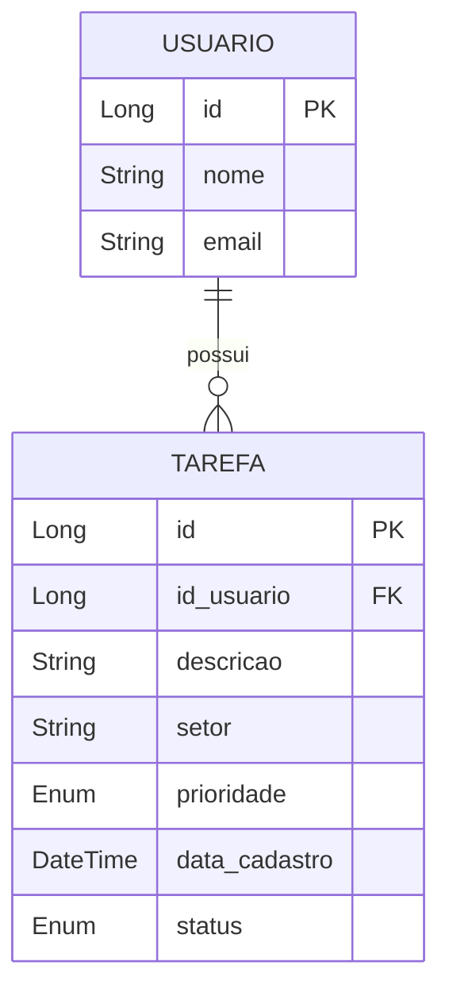
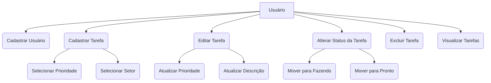

```mermaid
erDiagram
    USUARIO {
        Long id PK
        String nome
        String email
    }
    
    TAREFA {
        Long id PK
        Long id_usuario FK
        String descricao
        String setor
        Enum prioridade
        DateTime data_cadastro
        Enum status
    }
    
    USUARIO ||--o{ TAREFA : "possui"
```

```mermaid
graph TD
    A[Usuário] --> B(Cadastrar Usuário)
    A --> C(Cadastrar Tarefa)
    A --> D(Editar Tarefa)
    A --> E(Alterar Status da Tarefa)
    A --> F(Excluir Tarefa)
    A --> G(Visualizar Tarefas)
    
    C --> H(Selecionar Prioridade)
    C --> I(Selecionar Setor)
    D --> J(Atualizar Prioridade)
    D --> K(Atualizar Descrição)
    E --> L(Mover para Fazendo)
    E --> M(Mover para Pronto)

```